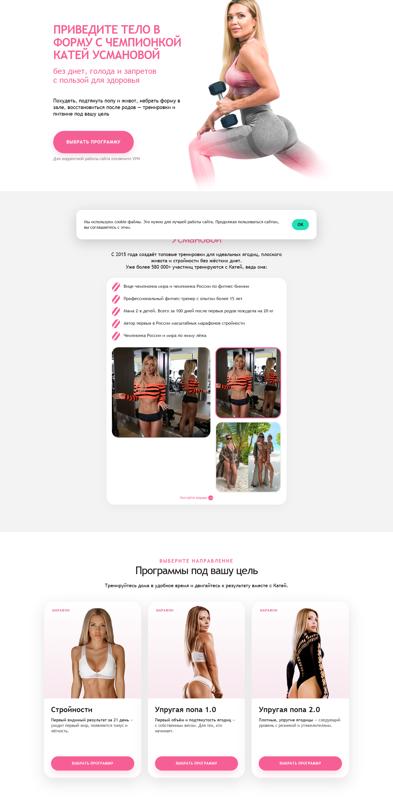
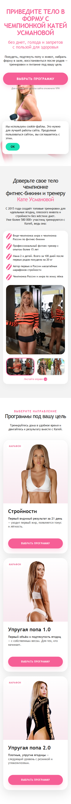

# Usmanova Fit — тестовое задание

Копия трёх экранов лендинга `usmanovafit.gymteam.ru/mainpage` для тестового задания на вакансию вайбкодера / сборщика лендингов и воронок на AI.

## Что сделано

- Повторены три ключевых экрана: первый экран, блок о тренере, блок с программами.
- Кнопки открывают модальное окно с формой.
- Форма валидирует имя, контакт и выбранную программу.
- На Vercel форма отправляет заявку через serverless API в Telegram.
- Для статического демо на GitHub Pages форма проходит весь пользовательский сценарий после валидации.
- Добавлены cookie-баннер, переключение фото в галерее и плавная навигация.
- Проверена адаптивность: десктоп и мобильный экран 375px без горизонтального скролла.

## Технологии

- HTML, CSS, JavaScript без тяжёлого фреймворка
- Vercel Functions для обработки формы
- Telegram Bot API для заявок
- Codex / AI-assisted vibe coding

## Проверка

- Unit-тесты в Node.js: валидация формы и API-обработчик.
- Browser QA через Playwright: desktop `1440×900`, mobile `375×812`.
- Проверены: открытие модального окна, ошибки валидации, успешная отправка, cookie-баннер, галерея, отсутствие горизонтального overflow.

## Скриншоты

## Переменные окружения для Vercel

Для реальной отправки заявок нужны:

- `TELEGRAM_BOT_TOKEN`
- `TELEGRAM_CHAT_ID`

## Время

Около 3 часов активной сборки, проверки и подготовки к публикации.
